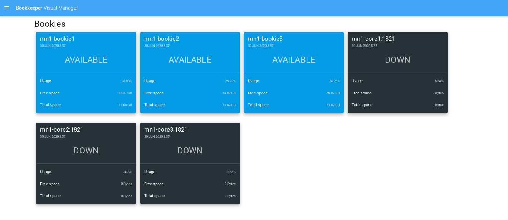
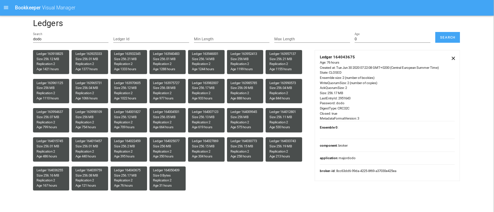

# BKVM - Visual Manager for Apache BookKeeper

Bookkeeper Visual Manager is an open source visual interface for [Apache
Bookkeeper](https://bookkeeper.apache.org/).

Features:
- Connect to a BookKeeper cluster (4.7+)
- Discover bookies and bookie status
- Search ledgers, using ledger metadata
- Inspect ledger metadata

Usecases:
- Inspect your BookKeeper cluster
- Check health of Bookies
- See which applications are using more resources
- Validate configuration of each application (check replication)
- See Clusterwide configuration

Roadmap:
- Support multi user access, multitenancy and multiple clusters
- Manage Bookies
- Manage replication
- Verify consistency of cluster
- Add advanced query functions
- Add API

## Overview

### Log in

Use the default account (`admin`) and the default password (`admin`) to log in.


### Bookies status

Bookies availability (AVAILABLE, DOWN, READONLY) and disk usage.



### Ledgers monitoring

Search for specific ledgers and ledgers metadata. Monitor ledger disk usage and replication factor.



### Bookies configuration


## Quickstart

### Requirements

In order to run BookKeeper Visual Manager you just need a Unix Machine and Java 8 runtime.

In order to develop BookKeeper Visual Manager you need Maven 3.6.x and Yarn.

### Using the provided release packages

Download a release package from github releases page.
Unzip the package

Configure the service by editing conf/server.properties
By default we will connect to ZooKeeper at localhost, like when you are using BookKeeper standalone.

Start the service

~~~~
bin/service server start
~~~~

Open your browser at
http://localhost:4500

Username and passwords are: admin/admin

### Docker
You can build the docker image by running:
```
mvn clean install -DskipTests
./docker/build.sh
```

Then you can run the container and the service will be listening on 0.0.0.0:4500:
```
docker run --rm -p 4500:4500 -e BKVM_metadataServiceUri='zk+null://<my-zookeeper>:2181/ledgers' bkvm/bkvm:latest
```
Please note that using this configuration the database will be persisted locally.

If you want instead to rely on BookKeeper for all the BKVM data (cluster configuration, bookies metadata) you can run the docker with the JDBC url option:
```
 docker run --rm -p 4500:4500 -e BKVM_metadataServiceUri='zk+null://bk:2181/ledgers' \
   -e BKVM_jdbc_url='jdbc:herddb:zookeeper:<my-zookeeper>:2181/herddb?server.mode=diskless-cluster' bkvm/bkvm:latest
```
Thanks to HerdDb `diskless-cluster` mode, the BKVM container is stateless.

#### Deploy BKVM on Kubernetes using Helm

You can use the sample [Helm Chart](kubernetes/README.md) to bootstrap BKVM on k8s.

#### Deploy the war application using Maven Jetty Plugin
~~~~
git clone https://github.com/diennea/bookkeeper-visual-manager.git
cd bookkeeper-visual-manager
mvn clean install -DskipTests
~~~~

To pass the Metadata Service URI connection string you have to set the system property
`bookkeeper.visual.manager.metadataServiceUri` or run the provided script in bin
folder.

~~~~
BVM_PORT=8080
BVM_SERVICEURI=zk+null://localhost:2181/ledgers

./bin/run_dev.sh $BVM_SERVICEURI $BVM_PORT
~~~~

#### Deploy the war application on container

You can also deploy the `target/bookkeeper-visual-manager-XX.XX.war` on your
container passing the `bookkeeper.visual.manager.metadataServiceUri` location in a system property.

#### Deploy the war application using Maven Jetty Runner

Download the jetty-runner jar available at [Maven
Central](https://repo1.maven.org/maven2/org/eclipse/jetty/jetty-runner/).

~~~~
BVM_PORT=8080
BVM_WAR_PATH=path/to/warfile

# Environment Variable configuration
BVM_CONF_PATH=/path/to/conf java -jar jetty-runner.jar $BVM_WAR_PATH --port $BVM_PORT
~~~~


### Advanced configuration

In order to use a more advanced configuration you need to provide to the
application a key/value properties file. An example file is provided in the conf/ folder.
**The provided file can also be your Bookkeeper Server configuration.**

| Property             | Value                              |
|----------------------|------------------------------------|
| metadataServiceUri   | Location of the Bookkeeper Server. |
| zkConnectionTimeout  | First connection timeout.          |
| zkTimeout            | Zookeeper session timeout.         |

You can provide this file to the application in three ways:
1. **System Property**: bookkeeper.visual.manager.config.path
    ~~~~
    BVM_PORT=8080
    BVM_CONF_PATH=path/to/warfile

    mvn jetty:run \
        -Dbookkeeper.visual.manager.config.path=$BVM_CONF_PATH \
        -Djetty.http.port=$BVM_PORT
    ~~~~
2. **Environment Variable**: BVM_CONF_PATH
    ~~~~
    BVM_PORT=8080
    BVM_WAR_PATH=path/to/warfile

    BVM_CONF_PATH=path/to/conf java -jar jetty-runner.jar $BVM_WAR_PATH --port $BVM_PORT
    ~~~~
3. **Deployment Descriptor**: bookkeeper.visual.manager.config.path in the web.xml
    ~~~~
    <context-param>
        <param-name>bookkeeper.visual.manager.config.path</param-name>
        <param-value>path/to/file</param-value>
    </context-param>
    ~~~~

## Development of the front-end

0. Clone this repo
0. Make sure you have installed node (v11.8.0) and yarn (1.19.1).
0. Go into the frontend folder `src/main/bvmui`
0. Install dependencies (use `yarn install` command)
0. Auto reload (use `yarn serve` command)
    ~~~~
    cd src/main/bvmui
    yarn install
    yarn serve
    ~~~~
0. Build (use `yarn build` command)

## Getting Involved

Feel free to create issues and pull request in order to interact with the community.

Please let us know if you are trying out this project, we will be happy to hear about your user case and help you.

### Release commands
```
git checkout master
mvn release:prepare
mvn release:perform
```

## License

Bookkeeper Visual Manager is under [Apache 2 license](http://www.apache.org/licenses/LICENSE-2.0.html).
